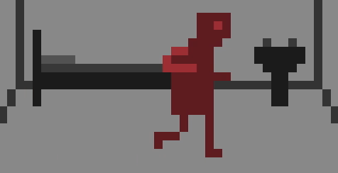

# *REAL BAKU 2015*

# [Play Online](https://www.pippinbarr.com/real-baku-2015/) (desktop and mobile)

## Description
REAL BAKU 2015 was developed for [FIDH, the International Federation for Human Rights](www.fidh.org), to raise awareness of arbitrary detentions in Azerbaijan leading up to the 1st European Games, essentially Europe&#8217;s version of the Olympics. It was created in collaboration with [Agence Babel](http://agencebabel.com/) in Paris, France. REAL BAKU 2015 was written in JavaScript/HTML5 using the [Phaser](http://phaser.io/) game framework. Sounds were created in [bfxr](http://www.bfxr.net/) the opening jingle was created in [Bosca Ceoil](http://distractionware.com/blog/2013/08/bosca-ceoil/).

See the [official FIDH press release](https://www.fidh.org/International-Federation-for-Human-Rights/eastern-europe-central-asia/azerbaijan/video-game-real-baku-2015-play-and-support-human-rights-in-azerbaijan).

## Documentation
* Read the [Process Documentation](../process)
* Look at the [Code Repository](https://github.com/pippinbarr/real-baku-2015) for source code etc.

## Press
* [Kill Screen](http://killscreendaily.com/articles/sports-game-actually-shows-human-repercussions-corruption/)
* [Boing Boing&#8217;s Offworld](http://boingboing.net/2015/06/12/this-game-sheds-light-on-human.html)
* [Venture Beat](http://venturebeat.com/2015/06/12/as-european-games-begin-this-offbeat-sports-game-highlights-political-prisoners-in-azerbaijan/)
* [Public Radio of Armenia](http://www.armradio.am/en/2015/06/11/fidh-launches-real-baku-2015-game-to-denounce-human-rights-abuses-in-azerbaijan/)
* [Business Insider](http://uk.businessinsider.com/this-video-game-protests-against-human-rights-abuses-in-azerbaijan-2015-6)
* [Oujevipo](http://oujevipo.fr/5-minutes/4497-real-baku-2015/)
* [Warp Door](http://wip.warpdoor.com/2015/06/13/real-baku-2015-pippin-barr/)
* [Destructoid](http://www.destructoid.com/a-game-that-fights-for-actual-social-justice-294520.phtml).

## License
*Best Chess* is licensed under a [Creative Commons Attribution-NonCommercial 3.0 Unported License](http://creativecommons.org/licenses/by-nc/3.0/).
