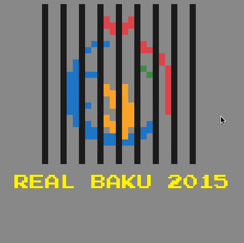
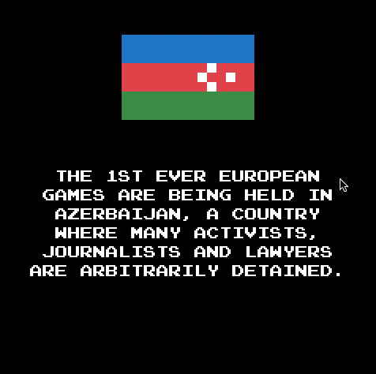
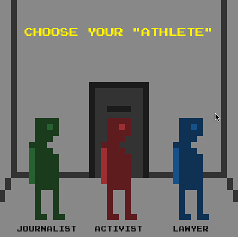
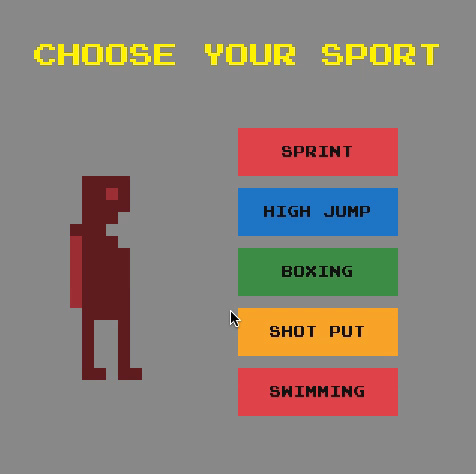
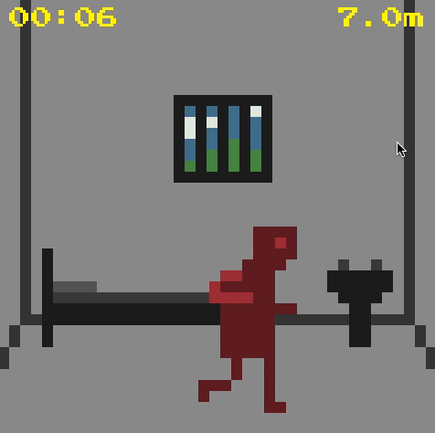
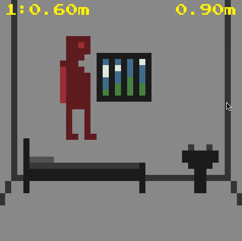
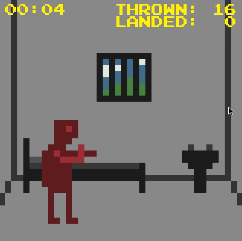
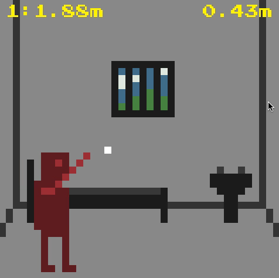
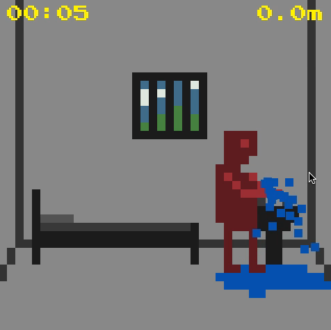
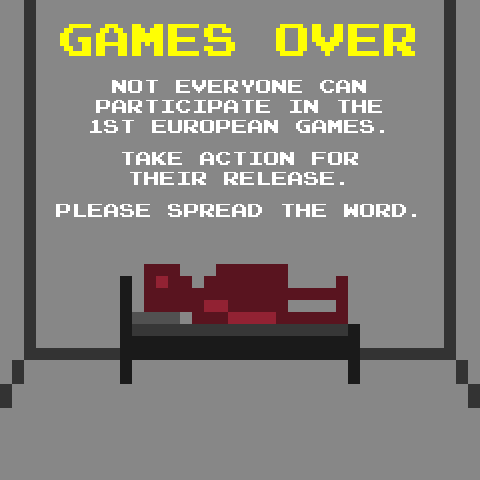

# *REAL BAKU 2015*

## Information
* Released: 10 June 2015
* Website: http://www.pippinbarr.com/
* Platforms: Browser
* Link: https://www.pippinbarr.com/real-baku-2015/info
* Price: Free.

## Description
*When is an international sporting event symbolising European unity and goodwill not an international sporting event symbolising European unity and goodwill?! When you’ve been arbitrarily detained by the Azerbaijan government!*

## History
REAL BAKU 2015 was developed for fidh, the International Federation for Human Rights, to raise awareness of arbitrary detentions in Azerbaijan leading up to the 1st European Games, essentially Europe's version of the Olymics. In 2015 these games are being held for the first time in Baku, Azerbaijan, but at the same time journalists, activists, lawyers, and others are being arbitrarily detained by the Azerbaijan government for being critical.

The original concept of creating a game as a way to communicate these ideas was developed by Agence Babel in Paris, France. The agency is doing the PR work for the overall campaign around the 1st European Games pro bono. The creative team of Romain Grange and Kamel Makhloufi led the idea of using games and of hiring Pippin Barr specifically to create an ironic version of the Baku Games 2015. Paul Wauters, a creative partner at Babel, supervised the overall project.

The game itself recasts some of the classic sporting events that will be present at the Baku Games to have them take place in prison, performed by arbitrarily detained prisoners to emphasise the disjunction between the freedom of sporting activity and the state of being confined to a cell. The various sports are made absurd and impossible to genuinely excel at by the situation. These arbitrary detentions are really happening. Please spread the word.

## Features
* "Sprint"
* "High Jump"
* "Boxing"
* "Shot Put"
* "Swimming"

## Images

## Trailer
[View the Trailer on YouTube](https://www.youtube.com/watch?v=YUzq1d73oWU)

## Links
* [fidh – The International Federation for Human Rights](http://www.fidh.org/index.html)
*	[Agence Babel](http://www.agencebabel.com/index.html)

## Credits
* Pippin Barr: Design and development
